<div align="center">
  
</div>

<div align="center">
  
</div>

<p align="center">
  <a href="https://www.linkedin.com/in/zeyadmohammeds/" target="_blank">
    
  </a>
  <a href="https://medium.com/@zeyadmoahmmed" target="_blank">
    
  </a>
  <a href="https://dev.to/zeyadmohammed" target="_blank">
    
  </a>
  <a href="mailto:zeyad.shosha@outlook.com">
    
  </a>
</p>

<div align="center">
  
  
  
</div>

<br>

<div align="center">

> "Code is like humor. When you have to explain it, it's bad." - Cory House

</div>

<br>

## 👨‍💻 DEVELOPER PROFILE

```typescript
interface Developer {
  name: string;
  location: string;
  role: string;
  expertise: string[];
  currentFocus: string[];
  philosophy: string;
}

const zeyad: Developer = {
  name: "Zeyad Mohammed",
  location: "Egypt 🇪🇬",
  role: "Full Stack Developer",
  
  expertise: [
    "🎯  Full Stack Development (.NET & JavaScript)",
    "⚛️  Modern Frontend (React, Next.js, TypeScript)",
    "🔧  Backend Architecture (.NET, C#, REST APIs)",
    "💾  Database Design (SQL Server, MySQL, MongoDB, Redis)",
    "🔐  Authentication & Security (JWT, OAuth)",
    "☁️  Cloud Services (Firebase, Supabase)",
  ],
  
  currentFocus: [
    "Building Scalable Learning Management Systems",
    "Modern Web Application Architecture",
    "Performance Optimization & Best Practices"
  ],
  
  philosophy: "Creating robust, user-centric applications that solve real-world problems."
};

console.log(`Initializing ${zeyad.name}'s development environment... 🚀`);
```

<br clear="right"/>

## 🚀 CURRENT PROJECTS & EXPERTISE

<div align="center">

<table>
<tr>
<td width="50%" valign="top">

### 💼 FULL STACK DEVELOPMENT


- **🎓 Course Management System**
  - Full-featured Learning Management System (LMS)
  - Student and instructor portals
  - Real-time course tracking and analytics
  - Interactive content delivery
  
- **⚛️ Frontend Engineering**
  - React & Next.js application development
  - TypeScript for type-safe code
  - Responsive design with Tailwind CSS
  - Modern UI/UX implementation
  
- **🔧 Backend Development**
  - .NET Core & C# APIs
  - RESTful API design
  - Database optimization
  - Authentication & authorization with JWT
  
- **📊 Database Architecture**
  - SQL Server & MySQL design
  - MongoDB for NoSQL solutions
  - Redis for caching strategies
  - Performance tuning & optimization

</td>
<td width="50%" valign="top">

### 🛠️ TECHNICAL TOOLKIT


- **🌐 Web Technologies**
  - HTML5, CSS3, JavaScript (ES6+)
  - TypeScript for enterprise applications
  - Responsive & accessible design
  - Progressive Web Apps (PWAs)
  
- **⚙️ Development Tools**
  - Visual Studio & VS Code
  - Git & GitHub for version control
  - Postman for API testing
  - Swagger for API documentation
  
- **☁️ Cloud & Services**
  - Firebase for real-time features
  - Supabase for backend services
  - Cloud deployment & hosting
  - Continuous integration/deployment
  
- **🎯 Best Practices**
  - Clean code principles
  - SOLID design patterns
  - Test-driven development
  - Agile methodologies

</td>
</tr>
</table>

</div>

---

## 🛠️ TECH STACK & TOOLS

<div align="center">

### 💻 Languages
<p>
  
</p>

### ⚡ Frontend Development
<p>
  
</p>

### 🔧 Backend Development
<p>
  
</p>

### 🗄️ Databases
<p>
  
</p>

### 🔧 Tools & Platforms
<p>
  
</p>

</div>

<details>
<summary>🔍 <strong>Detailed Technical Proficiency</strong></summary>
<br>

<div align="center">

| Category | Technologies | Proficiency |
|----------|-------------|-------------|
| **Frontend Development** | React • Next.js • TypeScript • JavaScript • HTML5 • CSS3 • Tailwind CSS | ⭐⭐⭐⭐⭐ |
| **Backend Development** | .NET Core • C# • ASP.NET • Node.js • Express.js • REST APIs | ⭐⭐⭐⭐⭐ |
| **Database Management** | SQL Server • MySQL • MongoDB • Redis • Database Design | ⭐⭐⭐⭐⭐ |
| **Authentication & Security** | JWT • OAuth • Identity Framework • Security Best Practices | ⭐⭐⭐⭐⭐ |
| **Development Tools** | Visual Studio • VS Code • Git • GitHub • Postman • Swagger | ⭐⭐⭐⭐⭐ |
| **Cloud Services** | Firebase • Supabase • Cloud Deployment • Real-time Features | ⭐⭐⭐⭐ |
| **API Development** | RESTful APIs • API Documentation • Swagger/OpenAPI • Testing | ⭐⭐⭐⭐⭐ |
| **Version Control** | Git • GitHub • Branching Strategies • Code Reviews | ⭐⭐⭐⭐⭐ |

</div>

</details>

---

## 📊 GITHUB ANALYTICS

<div align="center">
  
### 📈 Activity Overview
  
<p align="center">
  
  
</p>

### ⚡ Contribution Streak

<p align="center">
  
</p>

### 📊 Contribution Graph

<p align="center">
  
</p>

### 🏆 Achievements
<p align="center">
  
</p>

</div>

---

## 🌟 FEATURED PROJECTS

<div align="center">

### 🚀 Flagship Project

<table>
<tr>
<td width="100%" valign="top">

#### 🎓 [Course Management System](https://github.com/zeyadmohammeds)
**Full-Featured Learning Management System**

 

A comprehensive Learning Management System designed to deliver seamless online education experiences.

**Key Features:**
- 👥 Dual portals for students and instructors
- 📚 Course creation and management
- 📊 Real-time analytics and progress tracking
- 🎯 Interactive content delivery
- 💬 Discussion forums and messaging
- 📱 Responsive design for all devices

**Tech Stack:**
- **Frontend:** React, Next.js, TypeScript, Tailwind CSS
- **Backend:** .NET Core, C#, ASP.NET Web API
- **Database:** SQL Server, Redis (caching)
- **Authentication:** JWT, Identity Framework
- **Cloud:** Firebase/Supabase
- **Tools:** Git, Swagger, Postman

**Impact:**
- Streamlined course delivery
- Enhanced student engagement
- Scalable architecture
- Secure authentication system

</td>
</tr>
</table>

### 💼 Technical Capabilities

<table>
<thead>
<tr>
<th>Domain</th>
<th>Technologies Used</th>
<th>Expertise Level</th>
</tr>
</thead>
<tbody>
<tr>
<td><b>🎨 Frontend</b></td>
<td>React • Next.js • TypeScript • Tailwind CSS</td>
<td>🟢 Expert</td>
</tr>
<tr>
<td><b>⚙️ Backend</b></td>
<td>.NET Core • C# • REST APIs • JWT</td>
<td>🟢 Expert</td>
</tr>
<tr>
<td><b>💾 Databases</b></td>
<td>SQL Server • MySQL • MongoDB • Redis</td>
<td>🟢 Expert</td>
</tr>
<tr>
<td><b>🛠️ DevOps</b></td>
<td>Git • GitHub • CI/CD • Cloud Deployment</td>
<td>🟡 Proficient</td>
</tr>
<tr>
<td><b>☁️ Cloud</b></td>
<td>Firebase • Supabase • Cloud Services</td>
<td>🟡 Proficient</td>
</tr>
</tbody>
</table>

</div>

---

## 📝 TECHNICAL WRITING

<div align="center">

### ✍️ Latest Articles

[](https://medium.com/@zeyadmoahmmed)
[](https://dev.to/zeyadmohammed)

</div>

<div align="center">

### 📊 Content Focus Areas

 
 


</div>

---

## 🎯 DEVELOPMENT GOALS

```mermaid
graph LR
    A[🚀 Master Architecture] --> B[📱 Build More LMS Features]
    B --> C[☁️ Cloud Expertise]
    C --> D[🎤 Share Knowledge]
    D --> E[🌟 Open Source]
    E --> F[🌍 Global Impact]
    
    style A fill:#1e3a8a,stroke:#3b82f6,stroke-width:3px,color:#3b82f6
    style B fill:#1e40af,stroke:#3b82f6,stroke-width:3px,color:#3b82f6
    style C fill:#1e3a8a,stroke:#3b82f6,stroke-width:3px,color:#3b82f6
    style D fill:#1e40af,stroke:#3b82f6,stroke-width:3px,color:#3b82f6
    style E fill:#1e3a8a,stroke:#3b82f6,stroke-width:3px,color:#3b82f6
    style F fill:#3b82f6,stroke:#1e3a8a,stroke-width:3px,color:#1e3a8a
```

<div align="center">



### 🎯 Focus Areas

<table>
<thead>
<tr>
<th width="33%">Technical Growth</th>
<th width="33%">Project Development</th>
<th width="33%">Community</th>
</tr>
</thead>
<tbody>
<tr>
<td valign="top">
  
🚀 Advanced .NET patterns<br>
⚛️ React performance optimization<br>
☁️ Cloud architecture<br>
🔐 Security best practices<br>
📊 System design

</td>
<td valign="top">

🎓 LMS enhancements<br>
🚀 New features & modules<br>
📱 Mobile-first design<br>
🤖 AI integration<br>
💼 Real-world solutions

</td>
<td valign="top">

📝 Technical writing<br>
🌟 Open source contributions<br>
🤝 Developer mentorship<br>
💡 Knowledge sharing<br>
🎤 Community engagement

</td>
</tr>
</tbody>
</table>

</div>

---

## 📬 GET IN TOUCH

<div align="center">

### 💬 Let's Connect

<table>
<tr>
<td align="center" width="25%">
  <br>
  <b>🚀<br>Project<br>Collaboration</b>
</td>
<td align="center" width="25%">
  <br>
  <b>💼<br>Full Stack<br>Development</b>
</td>
<td align="center" width="25%">
  <br>
  <b>🎓<br>LMS & EdTech<br>Solutions</b>
</td>
<td align="center" width="25%">
  <br>
  <b>💡<br>Technical<br>Consultation</b>
</td>
</tr>
</table>

<p align="center">
  <a href="mailto:zeyad.shosha@outlook.com">
    
  </a>
  <a href="https://www.linkedin.com/in/zeyadmohammeds/" target="_blank">
    
  </a>
  <a href="https://medium.com/@zeyadmoahmmed" target="_blank">
    
  </a>
  <a href="https://dev.to/zeyadmohammed" target="_blank">
    
  </a>
</p>

### 🌟 Available For

<p align="center">
 
 


</p>

</div>

---

<div align="center">
  


### 🚀 "First, solve the problem. Then, write the code." 🚀


<sub>Crafted with 💙 by Zeyad Mohammed • © 2025</sub>


</div>
